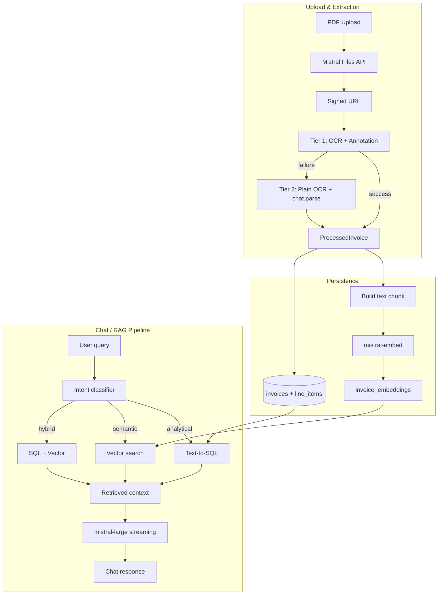

# 📄 Invoice Processor

**Extract structured data from invoice PDFs using Mistral AI**

[](https://streamlit.io/)
[](https://mistral.ai/)
[](https://python.org/)

A Streamlit application that uses Mistral's Document AI stack to:
-  Extract structured data (vendor, amounts, line items) from invoice PDFs
-  Validate extracted fields against the original document
-  Store data in SQLite with vector embeddings for semantic search
-  Query invoices through a RAG-powered chat interface

Try the streamlit cloud deployed version here: [invoice_ocr](https://ocrinvoicepipelinemistral.streamlit.app/)

## Quick Start

```bash
# 1. Clone and navigate
cd ocr_invoice_pipeline_mistral

# 2. Install dependencies
uv sync

# 3. Configure Mistral API key
cp .env.example .env
# Edit .env and add your MISTRAL_API_KEY

# 4. Run the app
uv run streamlit run app.py
```

The app will open in your browser at `http://localhost:8501`

##  Project Structure

```
ocr_invoice_pipeline_mistral/
├── app.py                    # Streamlit UI (3 tabs)
├── pipeline/
│   ├── schemas.py            # Pydantic data models
│   ├── ocr.py                # Mistral OCR wrapper
│   ├── extract.py            # Two-tier extraction pipeline
│   ├── database.py           # SQLite persistence
│   ├── embeddings.py         # Vector embeddings
│   └── rag.py                # RAG pipeline
├── components/
│   └── pdf_viewer.py         # PDF viewer component
├── data/                     # SQLite database (auto-created)
├── samples/                  # Sample invoice PDFs
└── tests/                    # Unit & smoke tests
```

##  Usage

### Upload and Extract Invoices

1. **Upload Tab**: Drag and drop invoice PDFs or use the file uploader
2. **Validation Tab**: Review extracted fields side-by-side with the PDF preview
3. **Edit & Save**: Correct any extraction errors and save to database

### Query Your Data

**Chat Interface**: Ask natural language questions about your invoices

```
# Examples:
"What was our total spending last month?"
"Show me all invoices from Acme Corp"
"Find invoices related to office supplies"
"What's the average invoice amount?"
```

**Database Tab**: Browse, search, and export all saved invoices

##  Features

### Two-Tier Extraction
- **Tier 1 (Fast)**: Single API call using `mistral-ocr-latest` with document annotation
- **Tier 2 (Robust)**: Fallback using plain OCR + `mistral-small-latest` chat parsing
- Automatic fallback ensures high reliability across different invoice formats

### Smart RAG Pipeline
- **Intent Classification**: Automatically detects query type (analytical, semantic, hybrid)
- **Dual Retrieval**: Uses SQL for structured queries and vector search for semantic queries
- **Streaming Responses**: Real-time chat responses with `mistral-large-latest`

### Local Database
- Single SQLite file with vector embeddings via sqlite-vec
- Transactional consistency between structured data and embeddings
- Full-text search and semantic search capabilities

##  Development

### Running Tests

```bash
# Unit tests (no API key needed, all Mistral calls are mocked)
uv run pytest -m "not smoke" -v

# Smoke tests (requires MISTRAL_API_KEY, hits real API)
uv run pytest -m smoke -v --timeout=120
```

### Environment Variables

```env
# Required
MISTRAL_API_KEY=your_api_key_here

# Optional
DEBUG=true                  # Enable debug logging
AUTO_SAVE_INVOICES=true     # Auto-save extracted invoices
```


## Architecture

```
app.py                    Streamlit UI (three tabs)
pipeline/
  schemas.py              Pydantic models: LineItem, InvoiceData, ProcessedInvoice
  ocr.py                  Mistral OCR wrapper with retry logic
  extract.py              Two-tier extraction pipeline
  database.py             SQLite + sqlite-vec persistence layer
  embeddings.py           Mistral embeddings wrapper
  rag.py                  Query routing, retrieval, and response generation
components/
  pdf_viewer.py           streamlit-pdf-viewer wrapper
data/                     SQLite database (gitignored, created on first run)
samples/                  Sample invoice PDFs for demo
tests/                    Unit tests (mocked) and smoke tests (real API)
```
## Mermaid Diagram



### Extraction pipeline

The extraction uses a two-tier approach to maximize reliability while keeping latency low.

**Tier 1 -- Document annotation.** A single API call to `mistral-ocr-latest` with `document_annotation_format` set to the `InvoiceData` JSON schema. This is the fast path: OCR and structured extraction happen in one round-trip. The Pydantic schema doubles as the annotation format, so there is no schema drift between validation and extraction.

**Tier 2 -- Chat parse fallback.** If annotation fails (malformed response, missing fields, API error), the pipeline runs plain OCR to get markdown, then passes it to `mistral-small-latest` via `chat.parse()` with the same Pydantic model as `response_format`. This is slower (two API calls) but more robust because the chat model can reason about ambiguous layouts.

Both tiers feed into the same `ProcessedInvoice` model. The `extraction_method` field tracks which path succeeded, so the UI can signal confidence level to the user.

### Persistence layer

The database is a single SQLite file (`data/invoices.db`) with three tables:

- **invoices** -- structured fields (vendor, dates, amounts, payment terms, raw markdown)
- **line_items** -- normalized line items with a foreign key to invoices
- **invoice_embeddings** -- a `vec0` virtual table from [sqlite-vec](https://github.com/asg017/sqlite-vec) storing 1024-dimensional vectors

Each invoice is embedded as a single chunk that combines structured fields (vendor name, amounts, dates) with truncated raw OCR text. This gives the vector index enough signal to match both precise field queries ("invoices from XXX") and semantic queries ("anything related to consulting services").

### RAG pipeline

The chat tab uses a dual-path retrieval system rather than pure context-stuffing or pure vector search.

**Intent classification.** Before retrieving, the user's query is classified by `mistral-small-latest` into one of three intents:

- **Analytical** -- aggregations, comparisons, counts, date filters. These are best answered by SQL, not semantic search. Example: "total spend by vendor this quarter."
- **Semantic** -- fuzzy matching, concept search, similarity. These need vector retrieval. Example: "find invoices related to office renovations."
- **Hybrid** -- needs both. Example: "cheapest supplier for paper products" requires joining structured price data with semantic understanding of product categories.

**Analytical path (text-to-SQL).** The LLM generates a `SELECT` query against the invoices and line_items schema. The query is executed read-only (only `SELECT` statements are allowed, enforced at the application level). If the generated SQL fails, the system falls back to returning all invoice data as context.

**Semantic path (vector search).** The user's query is embedded with `mistral-embed`, then matched against the `invoice_embeddings` table using sqlite-vec's nearest-neighbor search. The top results are formatted with key fields and similarity scores.

**Hybrid path.** Both retrieval paths run and their results are merged into a single context block.

The retrieved context is passed to `mistral-large-latest` for response generation with streaming. If the database is empty or RAG fails entirely, the system falls back to the original v1 approach of stuffing all session invoices into the system prompt.

### Why this design

**Two-tier extraction** avoids the common pitfall of building a fragile single-path pipeline. Annotation is fast but occasionally fails on unusual layouts; chat parse is slower but handles edge cases.

**Single-file database** keeps deployment simple. Maybe a next step would be to add a real db ?

**Intent-routed retrieval** avoids the weakness of pure vector search on structured queries. Asking "how many invoices did we receive last month" is a SQL query, not a similarity search. Routing to the right retrieval path produces better answers with less noise.

## Testing

```bash
# Unit tests (no API key needed, all Mistral calls are mocked)
uv run pytest -m "not smoke" -v

# Smoke tests (requires MISTRAL_API_KEY, hits real API)
uv run pytest -m smoke -v --timeout=120
```

## Built with

- [Mistral OCR 3](https://docs.mistral.ai/capabilities/document_ai/) -- document understanding and OCR
- [Mistral Small](https://docs.mistral.ai/getting-started/models/) -- structured extraction fallback, intent classification, text-to-SQL
- [Mistral Large](https://docs.mistral.ai/getting-started/models/) -- conversational response generation
- [Mistral Embed](https://docs.mistral.ai/capabilities/embeddings/) -- 1024-dim embeddings for vector search
- [sqlite-vec](https://github.com/asg017/sqlite-vec) -- vector similarity search in SQLite
- [Streamlit](https://streamlit.io/) -- web UI
- [Pydantic](https://docs.pydantic.dev/) -- schema validation and JSON schema generation
